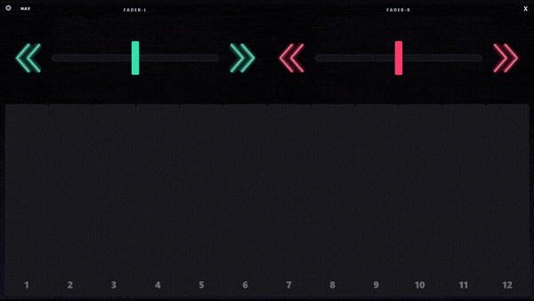

# PChordPad / [popnPad](https://github.com/OffbeatDX/popnPad)

Touch pad for PChord under [spice2x](https://spice2x.github.io/).



## Usage

> [!CAUTION]
> To send touch inputs to an elevated game, PChordPad must also be run as administrator.

- Run spice2x game with **API TCP Port** as **1337** (`-api 1337`), no API Pass (`-apipass`)
- Start PChordPad, adjust settings as necessary
- Enjoy!

## Build

Requires [Rust](https://rustup.rs/) **1.92+**.

```
create-release.bat
```

Linux and macOS are not supported.

## Versioning

Releases use `YYYY.M.D.V` based on the UTC release date.  
`V` increments from existing tags for that date, and the version is shown in Settings.

## License

PChordPad source code is licensed under the [MIT License](LICENSE).

Slint is used under the [Slint Royalty-free Desktop, Mobile, and Web Applications License](https://github.com/slint-ui/slint/blob/master/LICENSES/LicenseRef-Slint-Royalty-free-2.0.md).

[](https://slint.dev/)
